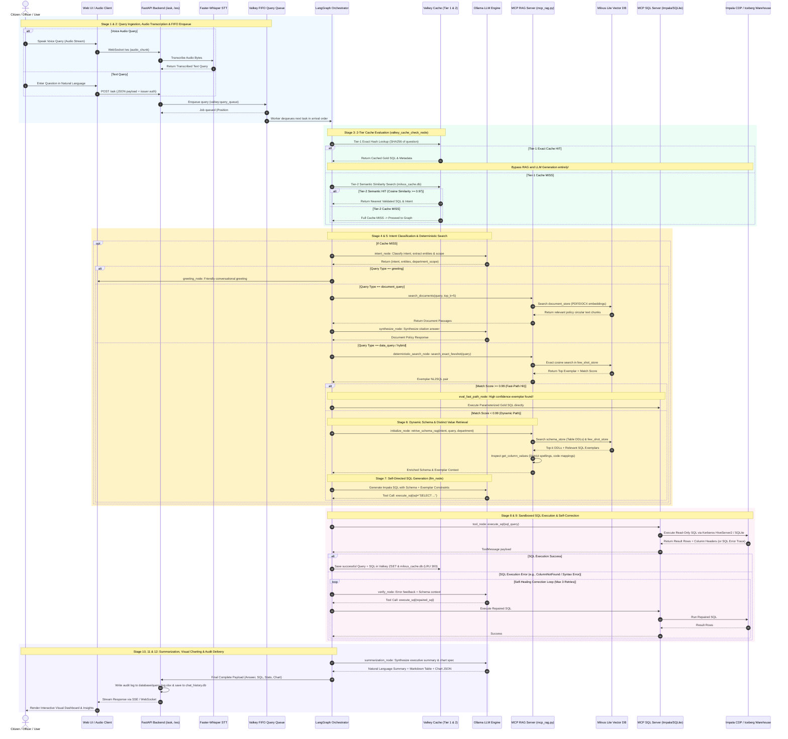
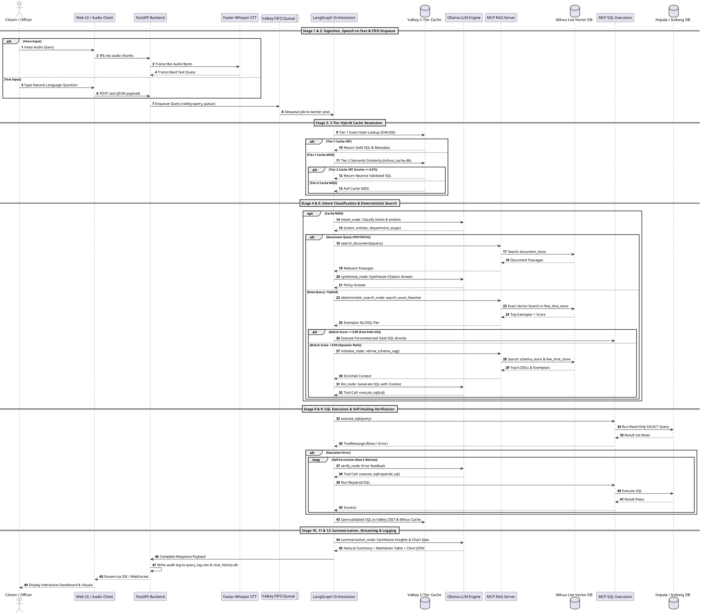

# Conversational Query Engine — End-to-End Sequential Architecture (v1.5.2)

This document details the exact sequence of execution across all 12 stages in the **AP Citizen 360 Conversational Query Engine**.

---

## 1. Universal Mermaid Sequence Diagram

You can paste this Mermaid block directly into GitHub Markdown, Notion, Obsidian, or [Mermaid Live Editor](https://mermaid.live).

---

## 2. PlantUML Specification

---

## 3. Detailed Stage Breakdown

| Stage | Name | Component | Key Operations |
|---|---|---|---|
| **01** | **Ingestion & STT** | `app.py`, `Faster-Whisper` | Ingests text/audio over `/ask` or `/ws`; transcribes audio streams in real-time. |
| **02** | **FIFO Enqueue** | `Valkey` / `valkey_queue` | Non-blocking push to `valkey:query_queue`; managed N-worker pool limits concurrency. |
| **03** | **2-Tier Cache** | `valkey_cache_check_node` | Tier-1 SHA256 exact match; Tier-2 Milvus Lite cosine similarity ($\ge 0.97$). |
| **04** | **Intent & Entities** | `intent_node`, `Ollama` | Extracts intent classification, temporal/spatial entities, and YAML department scope. |
| **05** | **Fast-Path Check** | `eval_fast_path_node` | If exact few-shot similarity $\ge 0.99$, directly binds gold SQL and executes. |
| **06** | **Schema Retrieval** | `initialize_node`, `MCP RAG` | Vector similarity search in `schema_store` (DDLs) and `few_shot_store`. |
| **07** | **SQL Generation** | `llm_node`, `Qwen2.5` | Generates partition-aware read-only Impala SQL with `execute_sql` tool call. |
| **08** | **SQL Execution** | `MCP SQL Server`, `Impala` | Executes queries against Impala CDP (Kerberos SASL) or local SQLite. |
| **09** | **Self-Correction** | `verify_node` | Evaluates execution status; automatically repairs SQL errors (up to 3 retries). |
| **10** | **Document RAG** | `doc_search_node`, `synthesize_node` | Retrieves policy guidelines and circulars from `document_store`. |
| **11** | **Summarization** | `summarization_node` | Synthesizes natural executive summary, markdown tables, and chart JSON. |
| **12** | **Delivery & Audit** | `FastAPI`, `openpyxl`, `sqlite3` | SSE/WS stream to frontend; appends to `chat_history.db` & `query_log.xlsx`. |
