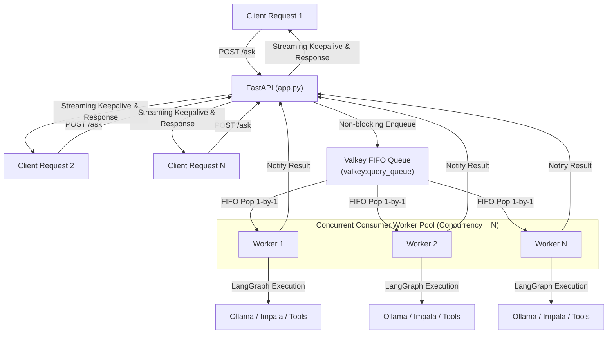

# Valkey Queue Architecture & Parallel Consumer Worker Pool (v1.5.4)

## Overview
Implement a robust Valkey-backed FIFO query queue and an asynchronous multi-worker consumer pool in `ap_citizen360_v1.5.4`. Incoming queries through `/ask` are queued immediately without blocking incoming HTTP requests. A pool of `N` concurrent workers processes queries in parallel from the queue in FIFO order, with comprehensive logging and queue metrics.

---

## 1. Architecture Design

---

## 2. Key Components

### A. Valkey Queue Manager (`database/valkey_queue.py`)
1. **FIFO Queue**: Uses Valkey list `RPUSH` to enqueue and `LPOP` / `BLPOP` for worker consumption.
2. **Job State Management**: Tracks status (`QUEUED`, `PROCESSING`, `COMPLETED`, `FAILED`, `CANCELLED`), timings (enqueued_at, started_at, finished_at, gen_time, exec_time, total_time), input payload, and execution output.
3. **Environment Variable Configuration**:
   - `VALKEY_WORKER_CONCURRENCY` / `MAX_CONCURRENT_WORKERS` (Default: `3`)
   - `VALKEY_URL` (Default: `redis://localhost:6379/0`)
4. **Resilience & Local Fallback**:
   - If Valkey server is running (e.g. RHEL production or Docker), connects to Valkey.
   - If Valkey server is offline or unavailable (e.g. local dev on Windows), transparently falls back to an in-memory asynchronous FIFO queue that follows the exact same contract and logging.
5. **Queue Metrics & Stats**:
   - Total enqueued, total completed, total failed, total cancelled, active jobs, current queue length.

### B. App Lifespan & Worker Pool Integration (`app.py`)
1. **Startup**: Spawns `N` independent async worker tasks on startup.
2. **Non-blocking `/ask`**: Immediately pushes query to queue, assigns `job_id`, streams keepalive spaces (` `) to preserve proxy timeouts, and resolves as soon as the worker completes execution.
3. **Cancellation**: Support for cancelling jobs in queue or aborting active tasks.
4. **Queue Status Endpoints & Action**:
   - `GET /queue/status` and `action="queue_status"` in `POST /ask` for real-time observability into queue depth, active worker count, and processing counts.
5. **Concurrency Safety**: Replaces the single global `request_lock = asyncio.Lock()` with the concurrent worker pool (`N` parallel workers).

### C. Comprehensive Logging
1. **Enqueue Log**: Timestamp, user, session, query, queue depth, job ID.
2. **Worker Start Log**: Worker ID, job ID, wait time in queue, active workers count.
3. **Execution Log**: LangGraph progress, timings (Gen time, Exec time, Total time).
4. **Completion Log**: Worker ID, status, SQL generated, row count, remaining in queue, total completed jobs.
5. **Excel & Chat History**: Preserved seamlessly across worker threads.

---

## 3. Proposed Changes

### [NEW] `database/valkey_queue.py`
- Implements `ValkeyQueueManager` class with enqueue, dequeue, job status tracking, metrics, cancellation, and worker loop abstractions.

### [MODIFY] `app.py`
- Import and initialize `ValkeyQueueManager` in `lifespan`.
- Route incoming `ask` queries through the non-blocking queue.
- Add `/queue/status` and `/queue/job/{job_id}` endpoints and `queue_status` action in `/ask`.
- Replace single-request lock with worker pool concurrency.

### [MODIFY] `.env` & `config.yaml` / `API_CONTRACT.md`
- Add `VALKEY_WORKER_CONCURRENCY=3` and documentation of the queue system and status endpoint.

---

## 4. Verification Plan

### Automated Tests
1. **Queue Unit Test (`test_valkey_queue.py`)**:
   - Enqueue multiple queries simultaneously.
   - Verify FIFO processing order.
   - Verify `N` concurrent workers execute queries in parallel.
   - Verify cancellation of pending jobs.
   - Verify metrics (enqueued count, completed count, queue length).
2. **API Endpoint Test**:
   - Send multiple concurrent requests to `/ask`.
   - Verify that all requests receive correct answers without 500 errors or deadlocks.
   - Verify `/queue/status` returns accurate counts.

### Manual Verification
- Review execution logs to ensure detailed queue entry, worker status, jobs done, and timing logs are output cleanly.
