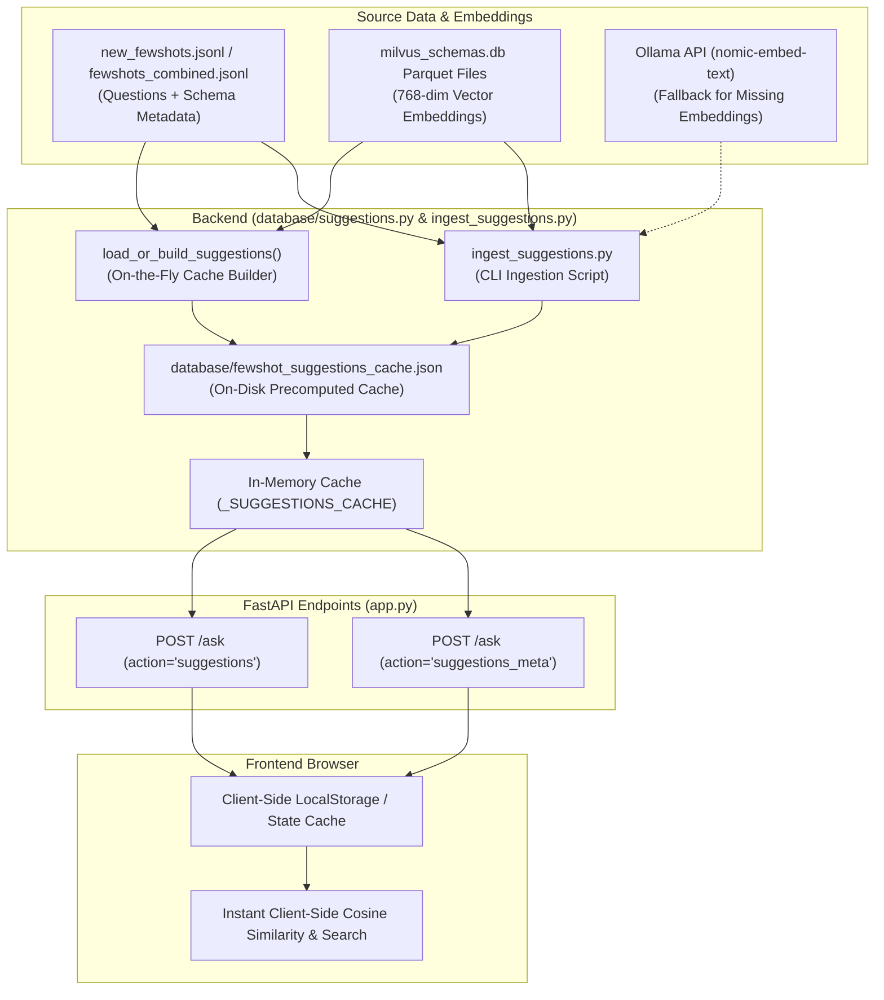

# Suggestion Cache System — AP Citizen 360 (v1.5.4)

Comprehensive technical documentation for the Few-Shot Suggestions Service, Caching Mechanism, Ingestion Workflow, and API Contract.

---

## 1. Executive Summary & Objectives

The **Suggestion Cache System** in `ap_citizen360_v1.5.4` provides pre-computed natural language question suggestions paired with **768-dimensional vector embeddings** directly to the client browser.

### Key Objectives:
- **100% Client-Side Ranking**: Enables frontend applications to perform vector similarity ranking and instant fuzzy filtering in the browser without querying backend vector databases for every keystroke.
- **Zero SQL Leakage**: All raw SQL queries are strictly excluded from the suggestion cache payload for security.
- **Zero-Latency In-Memory Serving**: Two-tier caching (In-Memory + On-Disk JSON) ensures response times under 5ms for suggestions metadata and list requests.
- **Dynamic & On-the-Fly Ingestion**: Automatically generates and compiles the cache if missing, while also providing a dedicated CLI script for dataset updates.

---

## 2. Architecture & Data Flow



---

## 3. How `load_or_build_suggestions` Works

The core logic resides in [`database/suggestions.py`](file:///d:/Office/Student_Dropout_v1.3.1-main/ap_citizen360_v1.5.4/database/suggestions.py).

### Execution Lifecycle:
1. **In-Memory Check**: Checks if `_SUGGESTIONS_CACHE` is already loaded in RAM. If present and `force_refresh=False`, it immediately returns the cached Python list.
2. **Disk Cache Check**: If not in RAM, checks if `database/fewshot_suggestions_cache.json` exists on disk. If found, it parses the JSON into RAM and returns.
3. **On-the-Fly Build**: If the JSON cache file does not exist (or `force_refresh=True`):
   - **Load Parquet Vectors**: Scans `milvus_schemas.db/collections/schema_chunks/partitions/few_shot_store/data/*.parquet` using pandas and indexes precomputed 768-dim vectors keyed by normalized question string.
   - **Load Fewshot Questions**: Resolves the fewshot dataset (prioritizing `new_fewshots.jsonl`, `FEWSHOTS_FILE` env variable, or `fewshots_combined.jsonl`).
   - **Attach Vectors & Sanitize**: Matches each question with its embedding, copies metadata (`id`, `intent`, `topic`, `difficulty`, `use_case`, `degree`, `tables`), and strips any raw SQL statements.
   - **Save to Disk & Memory**: Writes the structured array to `database/fewshot_suggestions_cache.json` and caches it in memory.

---

## 4. Ingestion CLI Script (`ingest_suggestions.py`)

A dedicated ingestion tool is located at [`ingest_suggestions.py`](file:///d:/Office/Student_Dropout_v1.3.1-main/ap_citizen360_v1.5.4/ingest_suggestions.py) to rebuild the suggestions cache on demand.

### Usage:

```bash
# 1. Run standard ingestion (uses new_fewshots.jsonl by default)
python ingest_suggestions.py

# 2. Ingest a specific few-shot file
python ingest_suggestions.py --file new_fewshots.jsonl

# 3. Ingest a custom file and force overwrite
python ingest_suggestions.py --file fewshots_combined.jsonl --output database/fewshot_suggestions_cache.json --force

# 4. Generate missing embeddings via Ollama (if any questions lack parquet vectors)
python ingest_suggestions.py --file new_fewshots.jsonl --embed-missing
```

### CLI Options:

| Option | Short | Description | Default |
| :--- | :--- | :--- | :--- |
| `--file` | `-f` | Path or filename of the JSONL few-shots source | `new_fewshots.jsonl` |
| `--output` | `-o` | Target output JSON path | `database/fewshot_suggestions_cache.json` |
| `--force` | | Force overwrite of the cache file | `False` |
| `--embed-missing`| | Use Ollama (`nomic-embed-text`) to compute vectors for questions not in parquet | `False` |
| `--no-verify` | | Skip post-build integrity assertions | `False` |

---

## 5. Schema & Payload Specification

### Output JSON Format (`database/fewshot_suggestions_cache.json`):

```json
[
  {
    "id": "001",
    "question": "How many male and female citizens are in the BC social category?",
    "intent": "",
    "topic": "",
    "difficulty": "",
    "use_case": "",
    "degree": "1",
    "tables": "ap_citizen360.dim_person",
    "embedding": [
      -0.0336028,
      0.0304140,
      -0.3255124,
      "..."
    ]
  }
]
```

### Field Descriptions:

| Field | Type | Description |
| :--- | :--- | :--- |
| `id` | `string` | Unique identifier of the fewshot item. |
| `question` | `string` | Natural language question presented to the user. |
| `intent` | `string` | Query intent classification (if present). |
| `topic` | `string` | Subject matter topic (if present). |
| `difficulty` | `string` | Complexity level (`easy`, `medium`, `hard`). |
| `use_case` | `string` | Domain identifier (e.g., `school_dropout`, `citizen360`). |
| `degree` | `string` | Degree of complexity / join depth. |
| `tables` | `string` | Comma-separated tables referenced. |
| `embedding` | `list[float]` | 768-dimensional normalized float vector. |

---

## 6. API Endpoints Contract

The API exposes the cache via the `/ask` route in [`app.py`](file:///d:/Office/Student_Dropout_v1.3.1-main/ap_citizen360_v1.5.4/app.py):

### 1. Fetch Suggestions List
* **Endpoint**: `POST /ask`
* **Request Body**:
```json
{
  "action": "suggestions",
  "limit": -1
}
```
* **Response**:
```json
{
  "status": "success",
  "count": 200,
  "updated_at": "2026-08-27T14:01:37.612283+00:00",
  "suggestions": [
    {
      "id": "001",
      "question": "How many male and female citizens are in the BC social category?",
      "degree": "1",
      "tables": "ap_citizen360.dim_person",
      "embedding": [-0.0336, 0.0304, -0.3255, "..."]
    }
  ]
}
```

### 2. Check Cache Metadata / Version
* **Endpoint**: `POST /ask`
* **Request Body**:
```json
{
  "action": "suggestions_meta"
}
```
* **Response**:
```json
{
  "status": "success",
  "count": 200,
  "updated_at": "2026-08-27T14:01:37.612283+00:00",
  "cache_file": "fewshot_suggestions_cache.json"
}
```

---

## 7. Verification & Testing

To verify the cache and ensure 100% vector embedding coverage:

```bash
python test_suggestions_local.py
```

### Test Suite Output:
- Validates 200/200 suggestions loaded from `new_fewshots.jsonl`.
- Confirms **100% (200/200)** 768-dim embeddings matched from Milvus parquet.
- Asserts that **0 raw SQL queries** are leaked.
- Validates dynamic loading and custom file parameters.
